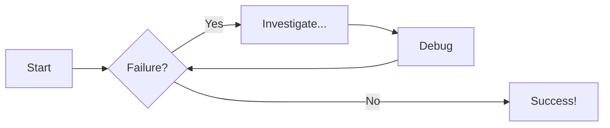
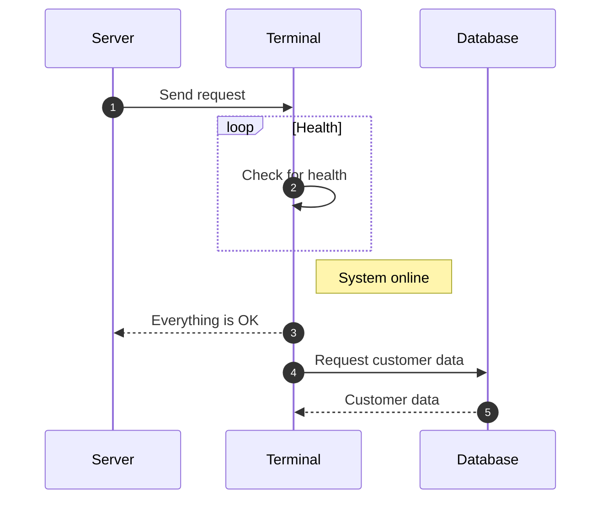

[Send :fontawesome-solid-paper-plane:](#){.md-button .md-button--primary}

## Diagram Examples

### Flowcharts



### Sequence Diagrams



## Commands

* `mkdocs new [dir-name]` - Create a new project.
* `mkdocs serve` - Start the live-reloading docs server.
* `mkdocs build` - Build the documentation site.
* `mkdocs -h` - Print help message and exit.

## Project layout

    mkdocs.yml    # The configuration file.
    docs/
        index.md  # The documentation homepage.
        ...       # Other markdown pages, images and other files.

```py title="add_numbers.py" linenums="1" hl_lines="2-3"
# Function to add two numbers
def add_two_numbers(num1, num2):
    return num1 + num2

# Example usage
result = add_two_numbers(5, 3)
print('The sum is:', result)
```

```sql title="sample_sql" linenums="1" hl_lines="1-2"
SELECT
    *
FROM
    project.dataset.table
```

## Content Tabs
This is an example of content tabs

### Generic Content

=== "Plan text"
    This is some plain text

=== "Un-ordered list"
    - Fist
    - Second
    - Third

=== "Ordered List"
    1. Fist
    2. Second
    3. Third

!!! note "Title of the callout"

    Lorem ipsum dolor sit amet, consectetur adipiscing elit. Nulla et euismod
    nulla. Curabitur feugiat, tortor non consequat finibus, justo purus auctor
    massa, nec semper lorem quam in massa.

???+ failure "Title of the callout"

    Lorem ipsum dolor sit amet, consectetur adipiscing elit. Nulla et euismod
    nulla. Curabitur feugiat, tortor non consequat finibus, justo purus auctor
    massa, nec semper lorem quam in massa.

!!! info inline end "Lorem ipsum"

    Lorem ipsum dolor sit amet, consectetur
    adipiscing elit. Nulla et euismod nulla.
    Curabitur feugiat, tortor non consequat
    finibus, justo purus auctor massa, nec
    semper lorem quam in massa.

!!! info inline "Lorem ipsum"

    Lorem ipsum dolor sit amet, consectetur
    adipiscing elit. Nulla et euismod nulla.
    Curabitur feugiat, tortor non consequat
    finibus, justo purus auctor massa, nec
    semper lorem quam in massa.